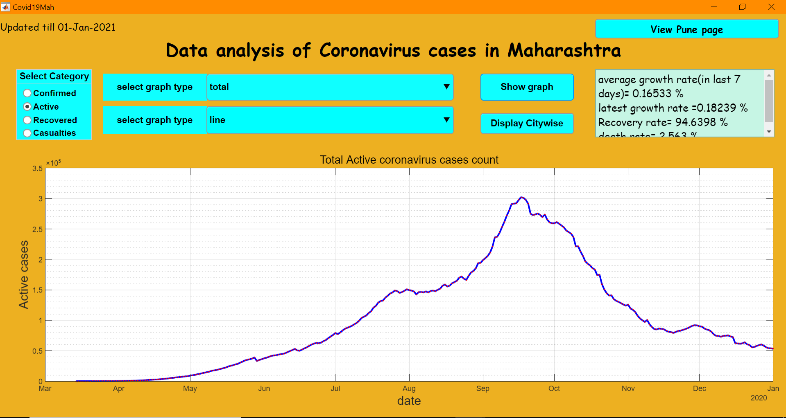
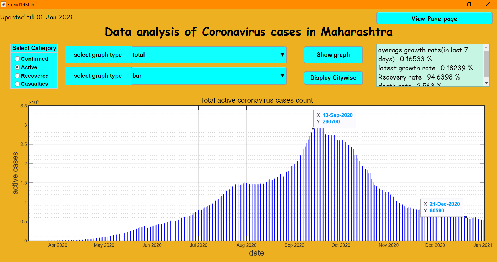
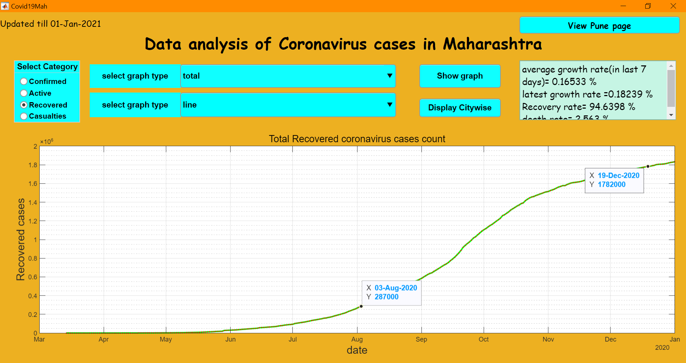
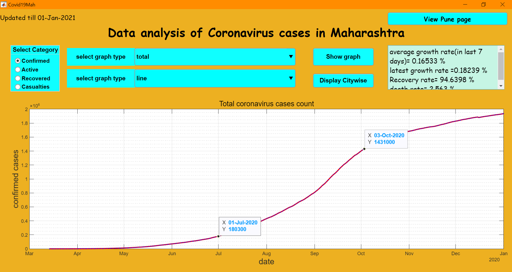

# Covid19-Mah
Data Analysis of Covid19 cases in Maharashtra, India using an API to get data in excel and visualizing data in MATLAB App designer

Active cases

Active cases bar graph

Recovery

Total Confirmed cases

